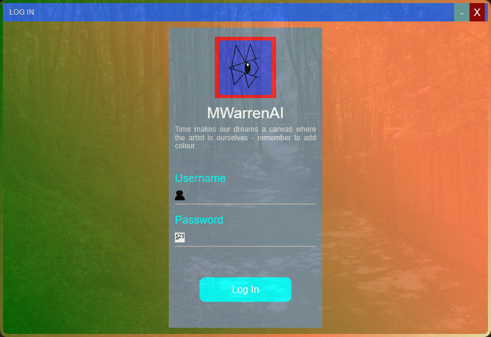

# WPFLoginForm

## Description

The WPF Login Form is a simple project I made to learn WPF, as such the login form demonstrates that the user can enter a username and password, this won't let the user log in as the form was only created for the sole purpose of understanding UI elements in C#.

## Sources

Code was adapted from the tutorial provided by RJ Code Advance: 

https://www.youtube.com/watch?v=byHcYRpMgI4

### Features:
- Displays UI Interface
- Allows username and password entry
- Minimize and close Window
- Login Button which also closes Window

[Back to Top](#WPFLoginForm)
